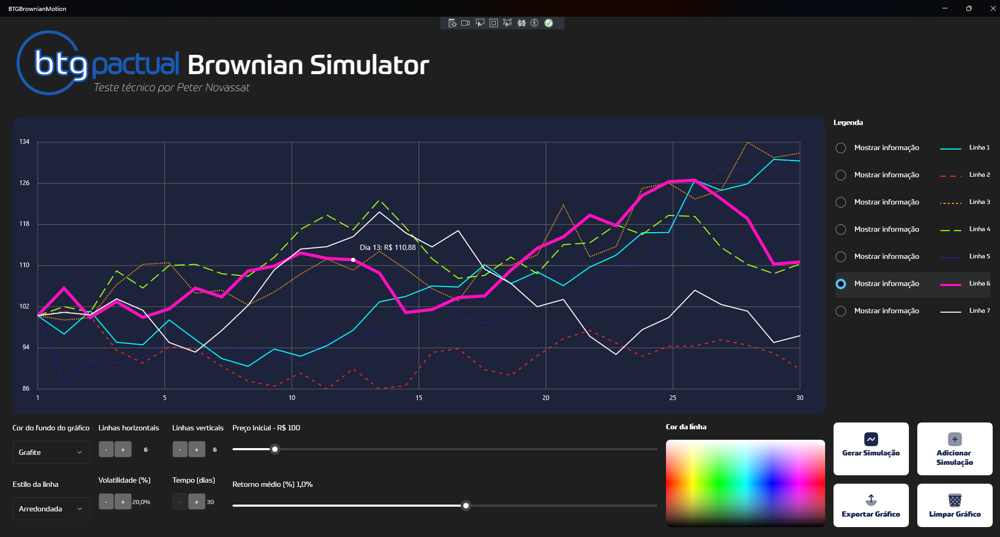
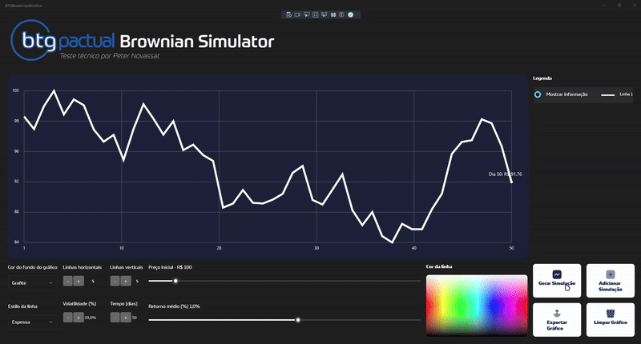

# BTG Pactual - Brownian Simulator

Aplicação de simulação gráfica baseada no Movimento Browniano, desenvolvida com **.NET MAUI** e renderização personalizada via **IDrawable + SkiaSharp**, utilizando arquitetura **MVVM com CommunityToolkit**.

---

## 🎯 Objetivo

O objetivo deste projeto é demonstrar a geração de simulações financeiras com base no modelo de movimento browniano, permitindo múltiplas curvas com controle visual interativo. É possível configurar:
- Cor de fundo do gráfico
- Estilo da linha
- Volatilidade e retorno
- Quantidade de dias
- Curvas múltiplas com animação progressiva

---

## 🛠️ Tecnologias Utilizadas

- [.NET MAUI (.NET 9)](https://learn.microsoft.com/dotnet/maui/)
- [SkiaSharp](https://github.com/mono/SkiaSharp)
- [Microsoft.Maui.Graphics.Skia](https://www.nuget.org/packages/Microsoft.Maui.Graphics.Skia)
- [CommunityToolkit.Mvvm](https://learn.microsoft.com/dotnet/communitytoolkit/mvvm/)
- [Color Picker](https://www.nuget.org/packages/nor0x.Maui.ColorPicker)

---

## 📸 Captura de Tela




---

## 🧩 Arquitetura

- `MainViewModel.cs`: responsável por gerar as curvas, tratar comandos (RelayCommand) e manter estado reativo.
- `PriceDrawable.cs`: classe personalizada que implementa `IDrawable`, lidando com toda renderização do gráfico.
- `MainPage.xaml.cs`: realiza o binding com o drawable, escutando alterações na ViewModel para sincronizar visualmente.

---

## 🚀 Funcionalidades

- Gerar simulação com curva única
- Adicionar novas simulações ao gráfico existente
- Exportar gráfico como imagem PNG
- Mostrar tooltip com valor e dia da curva
- Seleção de curvas na legenda para inspecionar

---

## ▶️ Executando o projeto

Certifique-se de ter o .NET 9 com suporte a MAUI configurado.

```bash
dotnet build
dotnet run
```

---

## 🧪 Testes Unitários

O projeto inclui uma suíte de testes unitários com xUnit, focando na `MainViewModel`.

```bash
dotnet test BTGBrownianMotion.Tests
```

---

## 📁 Estrutura de pastas

```
BTGBrownianMotion/
├── Features/
│   └── Main/
│       ├── MainPage.xaml / .cs
│       ├── MainViewModel.cs
│       └── PriceDrawable.cs
├── Models/
└── Resources/
```

---

## 🧠 Aprendizados e foco técnico

Este projeto evidencia domínio em:
- Gráficos customizados com `IDrawable` e `SkiaSharp`
- Integração UI reativa com `ObservableCollection` e `PropertyChanged`
- Animação personalizada por curva (progresso controlado)
- Arquitetura MVVM com código desacoplado e testável

---

## 📄 Licença

MIT © Peter Novassat